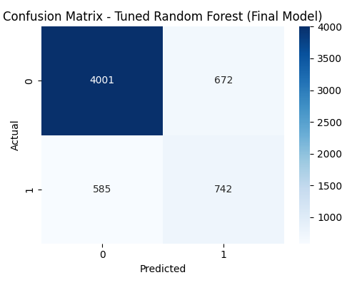

# 💳 Credit Card Default Risk Prediction using Machine Learning

## 📌 Problem Statement
Banks face financial losses due to customers defaulting on credit payments.  
The goal is to build a Machine Learning system that predicts whether a customer will default next month using historical financial and behavioral data.

---

## 🎯 Objective
- Detect high-risk customers early
- Reduce loan default losses
- Automate credit risk assessment
- Deploy a real-time prediction app

---

## 📊 Dataset
- Source: UCI Machine Learning Repository
- 30,000 customers
- 23 features + 1 target
- Includes demographics, bill amounts, payment history

---

## ⚙️ Project Pipeline

Data Inspection  
→ Cleaning  
→ Missing Value Treatment  
→ EDA  
→ Feature Engineering  
→ Train/Test Split  
→ Model Training (5 models)  
→ Hyperparameter Tuning  
→ Evaluation  
→ Deployment using Streamlit  

---

## 🤖 Models Used

| Model | Purpose |
|--------|------------|
| Logistic Regression | Baseline |
| Decision Tree | Rule-based |
| Random Forest | Ensemble (Final Model) |
| SVM | Margin-based |
| XGBoost | Boosting |

---

## 📈 Evaluation Metrics
- ROC-AUC
- Recall
- Confusion Matrix

Why?
Because minimizing False Negatives is critical in finance.

---

## 🏆 Final Model
**Tuned Random Forest**

Performance:
- ROC-AUC ≈ 0.77
- High Recall
- Reduced false negatives

---

## 📊 Sample Confusion Matrix


---

## 🚀 Deployment
Streamlit Web App

Run locally:
```bash
streamlit run src/app.py

```bash
streamlit run src/app.py
